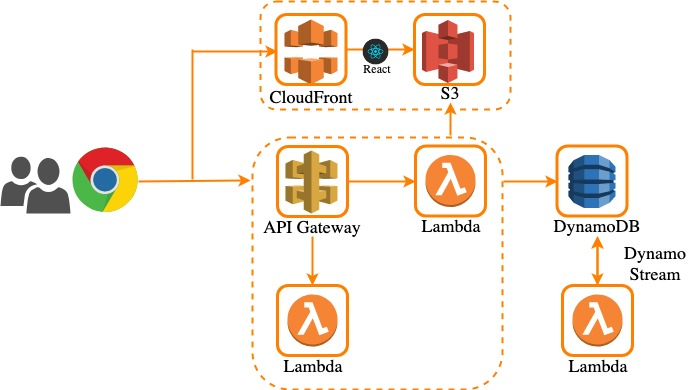

# Swagger viewer app

This service manages swagger(OpenAPI) of multiple servicies(for Micro service).
- Swagger, OpenAPI
- Multiple service
- Micro service
- Multiple version

# Deploy

```
$ yarn
$ sls build
$ sls deploy
```

# Test

```
$ go run test -v
```

# Architecture

This service is composed of AWS managed servicies such as Lambda, API Gateway, DynamoDB and Cloudfront.

